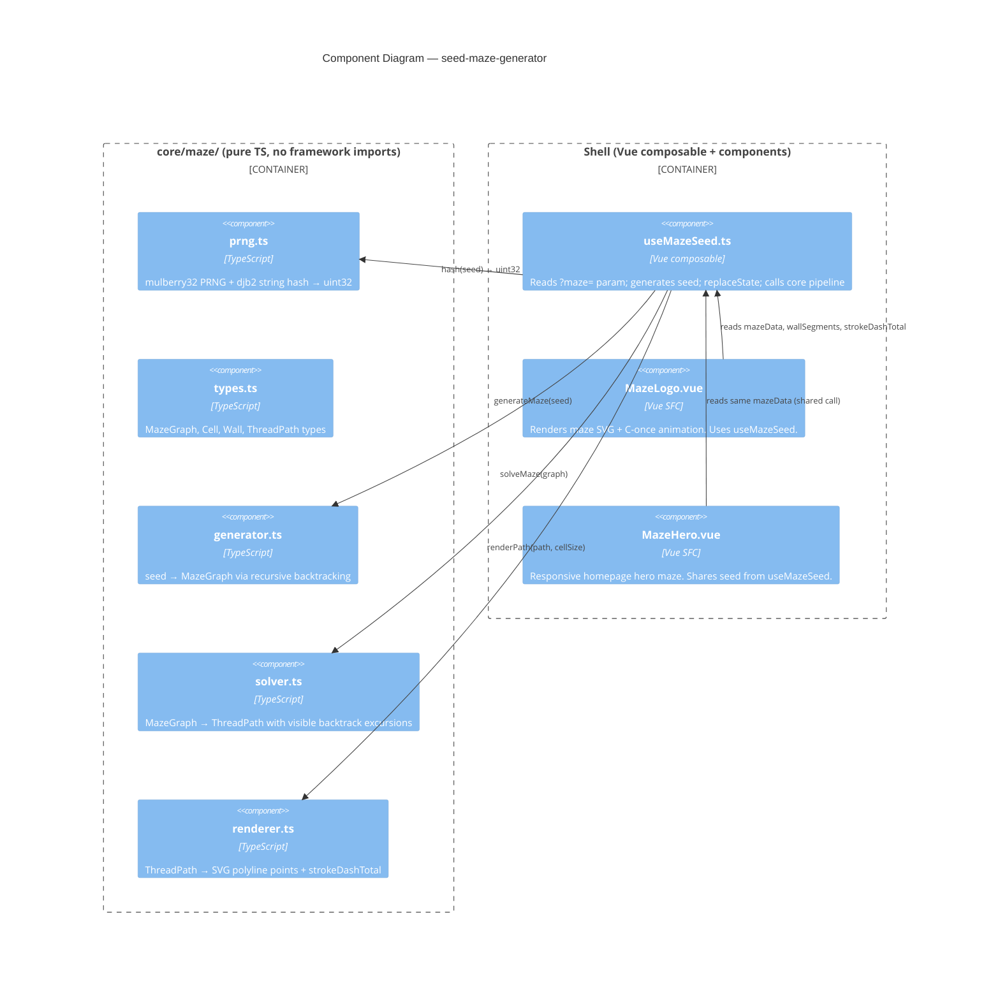

# Feature Delta — seed-maze-generator

<!-- Wave: DISCUSS | Date: 2026-05-18 | Agent: Luna (nw-product-owner)

---

## Wave: DISCUSS / [REF] Persona ID

**primary**: `owner-editor` — practice owner who discovers and curates seeded mazes via URL
**secondary**: `persona-prospective-client` — visitor who experiences the homepage hero maze as a first impression signal

---

## Wave: DISCUSS / [REF] JTBD One-Liner

**JOB-MZ-001** (owner): When I find a maze that feels right for the practice, I want the URL to carry the seed so I can share it, bookmark it, and make it permanent without hand-coding SVG.

**JOB-MZ-002** (visitor): When I land on the homepage, I want the animated logo to reward a second look, so I feel the practice has depth and intentionality before I read a word.

---

## Wave: DISCUSS / [REF] Locked Decisions

| #   | Decision             | Verdict                        | Rationale                                                                                                                                                                                         |
| --- | -------------------- | ------------------------------ | ------------------------------------------------------------------------------------------------------------------------------------------------------------------------------------------------- |
| D1  | Seed lifecycle       | Per-page, stateless            | No storage. Each page load without `?maze=` gets a new random seed written to URL via `replaceState`. Navigate away = new maze. Keeps the architecture simple and SSG-compatible.                 |
| D2  | Rendering target     | Client-side Vue composable     | SSG (`nuxt generate`) rules out dynamic server routes. Composable generates maze in `onMounted`; no flash risk on logo (small, header) since animation draws on.                                  |
| D3  | Two surface contexts | Logo (header) + Homepage hero  | Logo uses existing 440×440 SVG proportions. Homepage hero is a larger responsive treatment. Both share the same core generation logic.                                                            |
| D4  | Core architecture    | Pure Core / Imperative Shell   | `core/maze/` contains only pure TS functions (PRNG, generator, solver, renderer). `composables/useMazeSeed.ts` owns side effects (URL read/write). `MazeLogo.vue` and `MazeHero.vue` own the DOM. |
| D5  | Animation            | C-once (draw-on, hold, extend) | Thread draws itself once per page load. Stroke-dasharray length calculated from path, not hardcoded. Backtracks visible. Extension slows to ease-out at stopped point.                            |

---

## Wave: DISCUSS / [REF] User Stories

### S-MZ-001 — URL seed passthrough

**As** the owner-editor,
**I want** any URL with `?maze=<seed>` to always render the identical maze,
**So that** I can share or bookmark a specific maze and it remains stable.

### Elevator Pitch — S-MZ-001

Before: sharing the site URL shows a different maze on every load — there's no way to surface a specific one.
After: visit `daedaluscoaching.com/?maze=labyrinth` → sees the same maze on every device, every browser, every time.
Decision enabled: owner can commit a specific maze to a campaign, email, or OG image knowing it won't drift.

**Acceptance Criteria:**

- AC1: Given `?maze=labyrinth` in the URL, the maze rendered is identical across 3 consecutive page loads in different browsers.
- AC2: The seed string is case-sensitive (`?maze=Labyrinth` ≠ `?maze=labyrinth`).
- AC3: URL is not modified when a seed param is already present.

---

### S-MZ-002 — Random seed discovery

**As** the owner-editor,
**I want** a random seed generated and written to the URL when none is provided,
**So that** I can reload pages to discover mazes and copy the URL when I find one worth keeping.

### Elevator Pitch — S-MZ-002

Before: the maze is hand-coded SVG — there's nothing to discover.
After: load `daedaluscoaching.com/` → URL becomes `daedaluscoaching.com/?maze=k7f2m9` → copy URL → same maze always at that URL.
Decision enabled: owner can curate a library of good seeds by simply browsing and copying URLs.

**Acceptance Criteria:**

- AC1: On page load without `?maze=`, a seed is generated and written to the URL via `history.replaceState` (no navigation, no history entry).
- AC2: The seed is a 6-character alphanumeric string (sufficient entropy for visual variety without being unwieldy in URLs).
- AC3: Two consecutive loads without a seed produce different seeds (probabilistic — collision is acceptable but must be rare).
- AC4: The generated seed appears in the address bar before the animation begins.

---

### S-MZ-003 — Deterministic maze generation

**As** a developer,
**I want** a pure function `generateMaze(seed: string): MazeGraph` in `core/maze/`,
**So that** any seed always produces the same valid, solvable 10×10 maze.

### Elevator Pitch — S-MZ-003

Before: the maze is a hand-crafted wall list in the SVG — untestable and un-swappable.
After: call `generateMaze("labyrinth")` → receives a `MazeGraph` with exactly one solution path from C-top-arm entry to C-bottom-arm exit.
Decision enabled: developer can swap seeds and verify determinism in unit tests without touching the SVG.

**Acceptance Criteria:**

- AC1: `generateMaze(seed)` called twice with the same seed returns structurally identical graphs.
- AC2: The generated maze has exactly one solution (BFS from entry to exit finds one path; removing any wall creates a second).
- AC3: Entry is right wall row 1; exit is right wall row 9 (C-mouth convention established in logo design).
- AC4: The D-C boundary (column 4↔5) has at most 2 crossings in the generated maze.
- AC5: `core/maze/generator.ts` imports nothing from Vue, Nuxt, or any browser API — enforced by dependency-cruiser.

---

### S-MZ-004 — Thread path with visible backtracks

**As** a developer,
**I want** a pure function `solveMaze(graph: MazeGraph): ThreadPath` that returns the solution path plus two backtrack excursions in the visible zones,
**So that** the animation always shows the "lost then found" narrative regardless of seed.

### Elevator Pitch — S-MZ-004

Before: the backtrack points are hardcoded in the polyline — they don't survive a maze change.
After: call `solveMaze(graph)` → receives a `ThreadPath` with solution waypoints + 2 dead-end excursions guaranteed to be in rows 0–2 or rows 8–9.
Decision enabled: developer can regenerate the maze from any seed and the animation narrative is preserved automatically.

**Acceptance Criteria:**

- AC1: `solveMaze` returns exactly 2 backtrack excursions, each ≥ 2 steps before hitting a dead end.
- AC2: Each backtrack excursion originates from a cell in the visible zone (rows 0–2 above wings, or rows 8–9 below wings; col 0 spine counts as visible).
- AC3: The returned path is a valid sequence of adjacent cells (no teleportation).
- AC4: The `strokeDashTotal` field on `ThreadPath` equals the sum of all segment lengths (including backtracks) in pixels, calculated from cell size.
- AC5: `core/maze/solver.ts` imports nothing from Vue, Nuxt, or any browser API.

---

### S-MZ-005 — Logo component renders seeded maze

**As** a visitor,
**I want** the site logo to display an animated seeded maze on every page,
**So that** the logo rewards attention and communicates the labyrinth-as-journey metaphor.

### Elevator Pitch — S-MZ-005

Before: the logo is a static SVG with a hardcoded maze and thread.
After: load any page → `MazeLogo.vue` reads the URL seed, generates the maze, renders the SVG, and begins the C-once draw animation.
Decision enabled: visitor experiences a logo that is unique to this page load and narratively coherent.

**Acceptance Criteria:**

- AC1: `MazeLogo.vue` renders within 100ms of `onMounted` (maze generation is synchronous client-side).
- AC2: The animation begins automatically without user interaction.
- AC3: Wings overlay renders on top of the maze grid (z-order preserved from current design).
- AC4: The thread animation matches the C-once spec: linear draw → hold at stopping point → ease-out extension.
- AC5: The component accepts a `seed` prop that overrides URL-based seed (for Storybook/testing).

---

### S-MZ-006 — Homepage hero maze

**As** a visitor to the homepage,
**I want** a larger animated maze in the hero section,
**So that** the labyrinth metaphor lands with visual weight before I read the headline.

### Elevator Pitch — S-MZ-006

Before: homepage hero has no animated maze element — the metaphor is in the copy but not in the visual.
After: load `daedaluscoaching.com/` → hero section shows a full-width responsive maze SVG animating the thread path with the same seed as the logo.
Decision enabled: practice owner can choose to lead with the maze narrative on the homepage as a design direction.

**Acceptance Criteria:**

- AC1: `MazeHero.vue` renders the same maze as `MazeLogo.vue` (same seed = same graph = same thread path, different viewport size).
- AC2: Hero maze is responsive: fills its container width, maintains aspect ratio.
- AC3: Hero maze animation starts 0.3s after the logo animation to create a staggered effect.
- AC4: Hero maze is only present on `pages/index.vue` — no other page renders `MazeHero`.
- AC5: Disabling the hero maze (removing the component) does not break the logo.

---

## Wave: DISCUSS / [REF] Definition of Done

- [ ] All ACs verified by manual test across Chrome, Firefox, Safari
- [ ] `core/maze/` has ≥ 80% mutation kill rate (Stryker, scoped to generator + solver)
- [ ] Dependency-cruiser passes: no browser/Vue imports in `core/maze/`
- [ ] Animation plays correctly: draw → hold → extension visible and timed
- [ ] URL seed written before animation begins (AC4 of S-MZ-002)
- [ ] `?maze=` param round-trips: set in URL → same maze on reload
- [ ] Lighthouse performance score ≥ 90 on homepage with hero maze active
- [ ] No flash of unstyled/missing maze on initial load (animation-delay covers generation time)
- [ ] CLAUDE.md updated with seed-maze composable pattern if it introduces new conventions

---

## Wave: DISCUSS / [REF] Out of Scope

- Server-side maze generation / Netlify Functions (D2: client-side)
- Maze persistence across sessions (D1: per-page, no storage)
- User-facing seed picker UI (owner curates via URL)
- Multiple maze sizes beyond logo + hero (future)
- OG image generation from maze seed (future — requires SSR or build-time generation)
- Accessibility: maze is decorative, `aria-hidden="true"` sufficient for v1
- The seed-string API endpoint discussed in conversation (future spike)

---

## Wave: DISCUSS / [REF] Walking Skeleton Strategy

**Strategy: A** — thin end-to-end slice through all layers.

Slice 01 proves the URL plumbing (composable → URL → DOM) using the _existing_ hand-crafted maze SVG. No maze generation yet. The animation plays. The URL carries a seed. This confirms the full wiring before any algorithm work.

---

## Wave: DISCUSS / [REF] Driving Ports

| Port                             | Type                    | Consumer                                 |
| -------------------------------- | ----------------------- | ---------------------------------------- |
| `?maze=<seed>` URL param         | Inbound (user/owner)    | `useMazeSeed.ts` reads on `onMounted`    |
| `generateMaze(seed)`             | Internal function       | `useMazeSeed.ts` calls into `core/maze/` |
| `solveMaze(graph)`               | Internal function       | `useMazeSeed.ts` calls after generation  |
| `MazeLogo` component prop `seed` | Inbound (dev/Storybook) | Override for testing                     |

---

---

## Wave: DESIGN / [REF] DDD List

| #    | Decision                 | Verdict                                | Rationale                                                                                                                                                                       |
| ---- | ------------------------ | -------------------------------------- | ------------------------------------------------------------------------------------------------------------------------------------------------------------------------------- |
| DA-1 | Design scope             | Application / components               | No new bounded contexts; no distributed infra. Pure Core / Shell, same pattern as existing codebase.                                                                            |
| DA-2 | `core/maze/` module      | CREATE NEW                             | No algorithmic logic exists today. Follows `core/swoopy/` zero-import convention.                                                                                               |
| DA-3 | Composable `useMazeSeed` | CREATE NEW                             | URL side-effect distinct from any existing composable. `useContact` handles form, not URL param management.                                                                     |
| DA-4 | `MazeLogo.vue`           | REPLACE existing static SVG            | Current logo is a hand-crafted SVG file, not a component. New component takes its place.                                                                                        |
| DA-5 | `MazeHero.vue`           | CREATE NEW                             | Homepage-only, larger viewport; shares composable but not component with logo.                                                                                                  |
| DA-6 | Maze algorithm           | Recursive backtracking (Wilson-seeded) | Produces perfect mazes (exactly one solution). Simpler than Wilson's; predictable output shape. Seeded PRNG ensures determinism.                                                |
| DA-7 | PRNG                     | mulberry32                             | 4 lines, fast, well-distributed, seed is a uint32. djb2 hash maps string → uint32. No library needed.                                                                           |
| DA-8 | SVG rendering            | Computed template in Vue SFC           | No SVG library. Wall segments and polyline computed from MazeGraph in `<script setup>`. viewBox is fixed; cells are 40×40px within a 440×440 canvas (matching existing design). |
| DA-9 | Animation                | CSS `stroke-dashoffset` on polyline    | Existing design spec. `strokeDashTotal` computed from `ThreadPath` in `core/maze/renderer.ts`. No JS animation loop.                                                            |

---

## Wave: DESIGN / [REF] Component Decomposition

| Component        | Path                         | Type           | Change                |
| ---------------- | ---------------------------- | -------------- | --------------------- |
| PRNG + hash      | `core/maze/prng.ts`          | Pure TS        | CREATE                |
| Maze types       | `core/maze/types.ts`         | Pure TS types  | CREATE                |
| Maze generator   | `core/maze/generator.ts`     | Pure TS        | CREATE                |
| Maze solver      | `core/maze/solver.ts`        | Pure TS        | CREATE                |
| SVG renderer     | `core/maze/renderer.ts`      | Pure TS        | CREATE                |
| Seed composable  | `composables/useMazeSeed.ts` | Vue composable | CREATE                |
| Logo component   | `components/MazeLogo.vue`    | Vue SFC        | REPLACE static SVG    |
| Hero component   | `components/MazeHero.vue`    | Vue SFC        | CREATE                |
| Homepage wire-up | `pages/index.vue`            | Nuxt page      | EXTEND (add MazeHero) |

---

## Wave: DESIGN / [REF] Driving Ports

| Port                     | Surface                                | Handler                                             |
| ------------------------ | -------------------------------------- | --------------------------------------------------- |
| `?maze=<seed>` URL param | Browser address bar / shared link      | `useMazeSeed` reads via `useRoute()` on `onMounted` |
| `seed` prop              | Component API (`MazeLogo`, `MazeHero`) | Override for Storybook / testing                    |
| `generateMaze(seed)`     | Internal function call                 | `useMazeSeed` → `core/maze/generator.ts`            |

---

## Wave: DESIGN / [REF] Driven Ports + Adapters

| Port          | Adapter                                          | Side Effect                                           |
| ------------- | ------------------------------------------------ | ----------------------------------------------------- |
| URL write     | `history.replaceState(null, '', '?maze=<seed>')` | Writes seed to address bar; no navigation             |
| SVG DOM       | Vue template `<polyline>`, `<line>` bindings     | Renders wall segments and thread path                 |
| CSS animation | `<style>` block on `MazeLogo` / `MazeHero`       | `draw-maze` keyframe, duration from `strokeDashTotal` |

---

## Wave: DESIGN / [REF] Technology Choices

| Item                 | Choice                            | Pinned version   |
| -------------------- | --------------------------------- | ---------------- |
| Runtime              | Node 22, ESM                      | As per CLAUDE.md |
| Framework            | Nuxt 3 / Vue 3                    | Existing         |
| Language             | TypeScript (type-stripped)        | Existing         |
| PRNG                 | mulberry32 (inline, no package)   | n/a              |
| Maze algorithm       | Recursive backtracking            | n/a              |
| Hash                 | djb2 string → uint32 (6 lines)    | n/a              |
| SVG animation        | CSS `stroke-dashoffset`           | n/a              |
| Testing              | Vitest (unit), Stryker (mutation) | Existing         |
| Boundary enforcement | dependency-cruiser                | Existing         |

---

## Wave: DESIGN / [REF] Reuse Analysis

| Existing Component          | File                          | Overlap                        | Decision            | Justification                                                                 |
| --------------------------- | ----------------------------- | ------------------------------ | ------------------- | ----------------------------------------------------------------------------- |
| `useContact.ts`             | `composables/`                | `useRoute()` URL param pattern | EXTEND pattern only | Distinct concern; own file. `useContact` owns form state.                     |
| `core/swoopy/swoopy-url.ts` | `core/swoopy/`                | Pure function convention       | EXTEND convention   | `core/maze/` follows the same zero-import rule. No code sharing needed.       |
| `SwoopyEmbed.vue`           | `components/`                 | SVG rendering in component     | CREATE NEW          | Swoopy is an iframe. Maze is inline computed SVG. Fundamentally different.    |
| Existing logo SVG           | `public/logo.svg` (or inline) | Logo visual                    | REPLACE             | Static SVG replaced by `MazeLogo.vue`. Wings paths moved inline to component. |

---

## Wave: DESIGN / [REF] C4 Component Diagram — Maze Module



---

## Wave: DESIGN / [REF] Open Questions

| #    | Question                                                               | Deferred to                                                              |
| ---- | ---------------------------------------------------------------------- | ------------------------------------------------------------------------ |
| OQ-1 | Wing paths: keep in SVG asset or inline in component?                  | DELIVER — try both, pick the one that scales cleanly with viewBox        |
| OQ-2 | `MazeHero` size: what viewport/aspect ratio?                           | DELIVER Slice 05 — decide after first render                             |
| OQ-3 | Stryker scope: mutation-test generator + solver only, or renderer too? | DELIVER — renderer is mostly data transformation, likely worth including |
| OQ-4 | Seed entropy: 6-char base36 (2.2B combos) enough visual variety?       | DELIVER Slice 01 — verify empirically                                    |

---

---

## Wave: DISTILL / [REF] Scenario List

| Test file                               | Description                                     | Tags                            | Story              |
| --------------------------------------- | ----------------------------------------------- | ------------------------------- | ------------------ |
| `pipeline.test.ts`                      | seed → graph → path → points (walking skeleton) | `@walking_skeleton @strategy-a` | S-MZ-003/004/005   |
| `prng.test.ts` — hashString determinism | same input → same uint32                        | `@strategy-a`                   | S-MZ-003           |
| `prng.test.ts` — hashString range       | result ≥ 0 and integer                          | `@strategy-a`                   | S-MZ-003           |
| `prng.test.ts` — mulberry32 range       | values in [0, 1)                                | `@strategy-a`                   | S-MZ-003           |
| `prng.test.ts` — mulberry32 determinism | same seed → same sequence                       | `@strategy-a`                   | S-MZ-003           |
| `generator.test.ts` — determinism       | same seed → identical passage structure         | `@strategy-a`                   | S-MZ-001, S-MZ-003 |
| `generator.test.ts` — variety           | different seeds → different mazes               | `@strategy-a`                   | S-MZ-002, S-MZ-003 |
| `generator.test.ts` — solvability       | BFS finds path from entry to exit               | `@strategy-a`                   | S-MZ-003           |
| `generator.test.ts` — entry/exit        | right wall row 1 / row 9                        | `@strategy-a`                   | S-MZ-003           |
| `generator.test.ts` — D-C boundary      | ≤ 2 crossings across 5 seeds                    | `@strategy-a`                   | S-MZ-003           |
| `solver.test.ts` — solution path        | starts at entry, ends at exit, valid adjacency  | `@strategy-a`                   | S-MZ-004           |
| `solver.test.ts` — backtrack count      | exactly 2 excursions                            | `@strategy-a`                   | S-MZ-004           |
| `solver.test.ts` — backtrack length     | each ≥ 2 steps                                  | `@strategy-a`                   | S-MZ-004           |
| `solver.test.ts` — backtrack visibility | origins in visible zone (rows 0-2, 8-9, col 0)  | `@strategy-a`                   | S-MZ-004           |
| `solver.test.ts` — strokeDashTotal      | positive, ≥ solution length × 40                | `@strategy-a`                   | S-MZ-004           |
| `renderer.test.ts` — non-empty          | points string is non-empty                      | `@strategy-a`                   | S-MZ-005           |
| `renderer.test.ts` — point format       | each pair is valid `x,y` floats                 | `@strategy-a`                   | S-MZ-005           |
| `renderer.test.ts` — entry point        | first point is "420,80"                         | `@strategy-a`                   | S-MZ-005           |
| `renderer.test.ts` — determinism        | same path → same string                         | `@strategy-a`                   | S-MZ-005           |

---

## Wave: DISTILL / [REF] WS Strategy

**Strategy A — Pure domain, full in-memory.**

`core/maze/` has zero I/O. All five modules are pure functions. No filesystem, network, or browser APIs touched. `useMazeSeed` composable will mock `history.replaceState` in composable tests (added in Slice 01 TDD cycle — scaffolded separately once `vue-test-utils` pattern is confirmed).

Walking skeleton (`pipeline.test.ts`): seed → `generateMaze` → `solveMaze` → `renderPath` → assert non-empty string + positive dashTotal.

---

## Wave: DISTILL / [REF] Adapter Coverage

No driven adapters with I/O in `core/maze/` — all pure. `history.replaceState` (browser URL write) is the only side effect; it is in the composable shell, not core. Composable adapter test deferred to Slice 01 TDD (requires `happy-dom` or `jsdom` test environment).

| Adapter                            | @real-io scenario              | Status                              |
| ---------------------------------- | ------------------------------ | ----------------------------------- |
| `history.replaceState` (URL write) | composable Vitest test (jsdom) | Deferred to Slice 01 TDD            |
| Vue template SVG binding           | visual — not unit-testable     | Accepted: decorative, `aria-hidden` |

---

## Wave: DISTILL / [REF] Scaffolds

| File                         | Type                            | Marker                             |
| ---------------------------- | ------------------------------- | ---------------------------------- |
| `core/maze/types.ts`         | Types only — no scaffold needed | n/a                                |
| `core/maze/prng.ts`          | RED scaffold                    | `export const __SCAFFOLD__ = true` |
| `core/maze/generator.ts`     | RED scaffold                    | `export const __SCAFFOLD__ = true` |
| `core/maze/solver.ts`        | RED scaffold                    | `export const __SCAFFOLD__ = true` |
| `core/maze/renderer.ts`      | RED scaffold                    | `export const __SCAFFOLD__ = true` |
| `composables/useMazeSeed.ts` | RED scaffold                    | `export const __SCAFFOLD__ = true` |

All scaffold functions throw `Error("RED scaffold — {fn} not implemented")`. Imports resolve cleanly; tests fail with Error (RED classification in Vitest).

---

## Wave: DISTILL / [REF] Test Placement

```text
tests/unit/maze/
├── pipeline.test.ts      ← walking skeleton
├── prng.test.ts
├── generator.test.ts
├── solver.test.ts
└── renderer.test.ts
```

Precedent: Vitest unit tests follow `tests/unit/{domain}/` convention (project has `tests/e2e/` for Playwright). Tests excluded from Vitest while in worktree (`.claude/**` exclusion in `vitest.config.ts`) — run correctly once merged to main branch.

---

## Wave: DISTILL / [REF] Driving Adapter Coverage

| Driving port             | Entry point                | Scenario                                              |
| ------------------------ | -------------------------- | ----------------------------------------------------- |
| `?maze=<seed>` URL param | `useMazeSeed()` composable | Deferred to Slice 01 TDD (composable test with jsdom) |
| `generateMaze(seed)`     | `core/maze/generator.ts`   | `generator.test.ts` — all 6 scenarios                 |
| `solveMaze(graph)`       | `core/maze/solver.ts`      | `solver.test.ts` — all 7 scenarios                    |
| `renderPath(path)`       | `core/maze/renderer.ts`    | `renderer.test.ts` — all 4 scenarios                  |

---

## Wave: DISTILL / [REF] Pre-Requisites

- DESIGN component decomposition (DA-1 through DA-9) ✓
- `core/maze/types.ts` interface definitions ✓
- Vitest configured and running (`pnpm test`) ✓
- No DEVOPS wave — default environment matrix applies (clean, no external services)

---

## Wave: DISCUSS / [REF] Pre-Requisites

- Existing `logomaze.svg` design (complete — this session)
- Animated thread polyline spec (complete — this session, C-once)
- Nuxt 3 + Vue 3 project running (`nuxt generate`, Netlify)
- dependency-cruiser configured for `core/` boundary enforcement (per CLAUDE.md)
