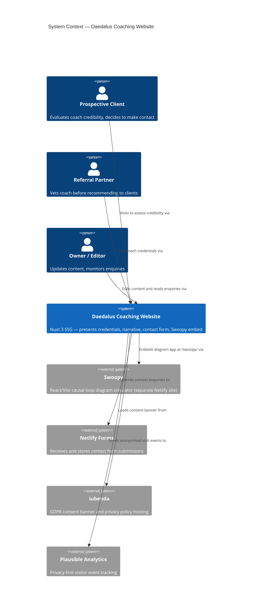
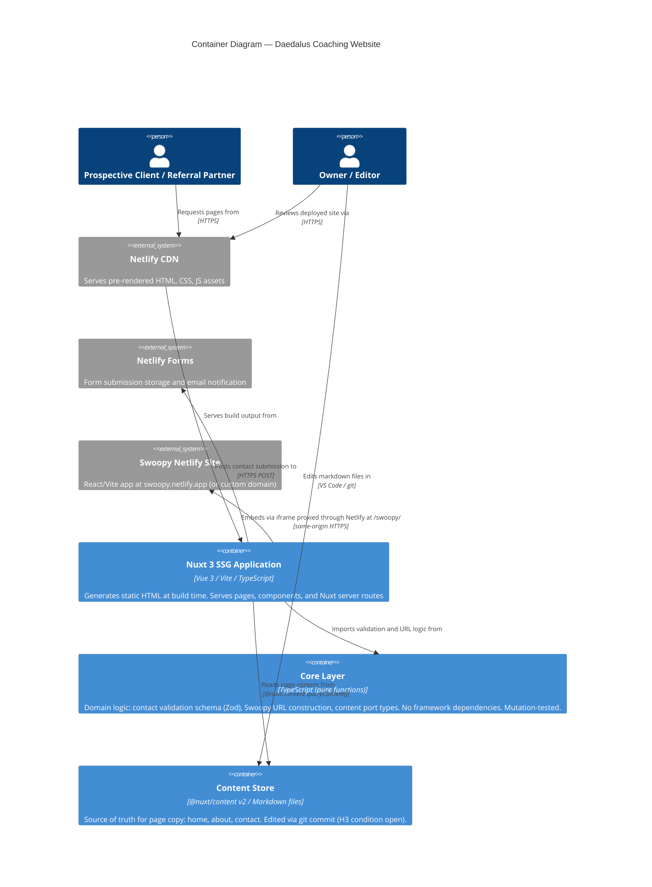

# Architecture Brief — Daedalus Coaching Website Redesign

feature_id: daedalus-coaching-website-redesign
wave: DESIGN
date: 2026-05-12
status: PEER REVIEWED — APPROVED FOR HANDOFF (iteration 1, 0 critical/high, 1 medium resolved)
architect: Morgan (Solution Architect, nWave DESIGN wave)

---

## System Context

Daedalus Coaching is a solo executive coaching practice. The website is the primary digital
channel for warm-referral visitors assessing the coach's credibility before agreeing to a
discovery call. It is not an acquisition channel — it is a trust gate.

**Primary actors**:

- Prospective Client: arrives via referral, assesses credibility, decides whether to make contact
- Referral Partner: vets the coach's legitimacy before sending clients
- Owner-as-Editor: updates copy and positioning without engineering friction

**External systems**:

- Netlify: static site hosting, form submission handling, proxy routing to Swoopy
- Swoopy: React/Vite causal loop diagram app at `~/projects/swoopy`, deployed separately
- iubenda: GDPR consent banner (third-party script)
- Plausible (or equivalent privacy-first analytics): visitor behaviour signals

---

## Application Architecture

### Architectural Style Decision

**Pure Core / Imperative Shell** (hexagonal architecture expressed through functions).
Full rationale in ADR-001.

This is the owner's global engineering default (CLAUDE.md). It is not adopted speculatively —
it solves a concrete problem: Stryker mutation testing requires pure functions with no mocks,
and the DISCOVER wave established that the prior codebase had no working tests (S5). The
architecture makes testability a structural property, not a discipline.

Rejected simpler option: standard layered Nuxt (pages → composables → utilities). Adequate
for tutorials; does not enforce the testability constraint mechanically.

---

## C4 System Context Diagram (L1)



---

## C4 Container Diagram (L2)



---

## Component Architecture

### Directory Structure (enforced by dependency-cruiser)

```text
/
├── core/                        # Pure functions only — NO framework imports
│   ├── contact/
│   │   ├── contact-schema.ts    # Zod schema — canonical validation contract
│   │   └── contact-port.ts      # SubmissionPort type signature
│   ├── content/
│   │   └── content-port.ts      # ContentPort type signature (swappable adapter)
│   └── swoopy/
│       └── swoopy-url.ts        # Pure: modelId/graph → URL string
│
├── composables/                 # Shell: Vue reactivity + port adapters (driving)
│   ├── useContact.ts            # Calls core schema, submits via SubmissionPort adapter
│   └── usePageContent.ts        # Calls @nuxt/content, maps to ContentPort shape
│
├── server/
│   └── api/
│       └── contact.post.ts      # Server route: validates via core schema, forwards to Netlify
│
├── components/
│   ├── TrustSignals.vue         # B-Corp, 1%FTP, accreditations — above fold
│   ├── ContactForm.vue          # Single CTA component — uses useContact composable
│   ├── SwoopyEmbed.vue          # iframe wrapper — src from core/swoopy/swoopy-url.ts
│   └── ...                      # Remaining layout and presentation components
│
├── pages/
│   ├── index.vue                # Homepage — trust-first IA, single CTA
│   ├── about.vue                # Narrative about page
│   └── contact.vue              # Contact page with ContactForm
│
├── assets/
│   └── tokens.css               # CSS Custom Properties — single design token source
│
└── content/                     # @nuxt/content markdown files
    ├── home.md
    ├── about.md
    └── contact.md
```

### Dependency Rules (dependency-cruiser, enforced in CI)

| Rule               | Description                                                                                            |
| ------------------ | ------------------------------------------------------------------------------------------------------ |
| core-is-pure       | `core/` may not import from `composables/`, `server/`, `components/`, `pages/`, or any Nuxt/Vue module |
| shell-imports-core | `composables/` and `server/` may import from `core/`                                                   |
| components-no-core | `components/` and `pages/` import from `composables/`, not directly from `core/`                       |

Violation = build failure. Architecture is load-bearing, not conventional.

---

## Ports and Adapters

### Driving Ports (inbound — Shell initiates, Core defines interface)

| Port                    | Location                         | Description                                                                      |
| ----------------------- | -------------------------------- | -------------------------------------------------------------------------------- |
| Contact form submission | `core/contact/contact-schema.ts` | Zod schema is the contract; composable and server route both validate against it |
| Page content retrieval  | `core/content/content-port.ts`   | Typed function signature returning plain TS object (no Vue Ref)                  |

### Driven Ports + Adapters (outbound — Core defines port, Shell implements adapter)

| Port              | Adapter (v1)                                    | Fallback (SPIKE / H3 fail)                    |
| ----------------- | ----------------------------------------------- | --------------------------------------------- |
| `SubmissionPort`  | `server/api/contact.post.ts` → Netlify Forms    | Resend or custom SMTP adapter                 |
| `ContentPort`     | `composables/usePageContent.ts` → @nuxt/content | Decap CMS or Nuxt Studio adapter              |
| `SwoopyEmbedPort` | `SwoopyEmbed.vue` → `<iframe>` proxy URL        | Web Component (`<swoopy-diagram>`) — SPIKE-01 |

---

## Technology Stack

| Component              | Technology                         | Version           | Licence                 | Rationale                                                 |
| ---------------------- | ---------------------------------- | ----------------- | ----------------------- | --------------------------------------------------------- |
| Framework              | Nuxt 3                             | ^3.x              | MIT                     | Pre-decided; Vue learning harness; SSG for static hosting |
| Runtime language       | TypeScript (type-stripped)         | ^5.x              | Apache 2.0              | Owner preference; ESM; no build overhead                  |
| Validation             | Zod                                | ^3.x              | MIT                     | Pre-decided; central to contact schema in core/           |
| Content                | @nuxt/content v2                   | ^2.x              | MIT                     | Pre-decided; markdown-in-repo; H3 condition open          |
| Testing (unit)         | Vitest                             | ^2.x              | MIT                     | Native Vite integration; fast; no config overhead         |
| Testing (e2e)          | Playwright                         | ^1.x              | Apache 2.0              | Multi-browser; outer TDD loop                             |
| Mutation testing       | Stryker (stryker-vitest)           | ^8.x              | Apache 2.0              | Core/ purity makes it viable without mocks                |
| Component testing      | Vue Test Utils                     | ^2.x              | MIT                     | Official Vue testing library                              |
| CSS tokens             | CSS Custom Properties + Stylelint  | — / ^16.x         | MIT                     | Zero-dependency token system; lint-enforced               |
| Token lint plugin      | stylelint-declaration-strict-value | ^1.x              | MIT                     | Enforces var(--token-\*) requirement                      |
| Dependency enforcement | dependency-cruiser                 | ^16.x             | MIT                     | CI enforcement of core/shell boundary                     |
| Pre-commit             | lefthook                           | ^1.x              | MIT                     | Hooks: pnpm test --run + stylelint                        |
| Deployment             | Netlify                            | Free tier         | Proprietary (hosting)   | Pre-decided; Netlify Forms included                       |
| Swoopy proxy           | Netlify redirect rules             | —                 | —                       | Same-origin iframe via netlify.toml                       |
| GDPR consent           | iubenda                            | —                 | Proprietary (SaaS)      | Pre-existing; legal requirement                           |
| Analytics              | Plausible                          | Cloud / self-host | AGPL (self-host) / SaaS | Privacy-first; GDPR-compatible                            |

No unjustified proprietary dependencies. Netlify and iubenda are pre-existing decisions
with legal/operational rationale. Plausible's AGPL licence applies only to self-hosted
deployment; cloud usage is SaaS subscription (owner's choice).

---

## Quality Attribute Strategies

### Maintainability

- Pure Core / Imperative Shell: core logic is isolated, replaceable
- Dependency-cruiser enforcement: boundary cannot erode silently
- Design token enforcement (Stylelint): visual system cannot drift
- Walking Skeleton first: architecture risk resolved before feature build-out

### Testability

- `core/` is pure functions — Vitest with no mocks, Stryker mutation testing
- Outside-In TDD: Playwright acceptance test defines behaviour before implementation
- Pre-commit hook blocks failing unit tests

### Operational Simplicity

- SSG (static site generation): no server to maintain, no runtime dependencies
- Netlify free tier: zero infrastructure management
- Swoopy deployed separately: independent deployments, no build coupling

### Performance

- SSG: all pages pre-rendered, served from CDN edge
- No client-side data fetching on initial load (content is build-time)
- iubenda and Plausible load asynchronously (non-blocking)

### Security

- No user authentication — not in scope for v1
- Contact form: server-side Zod validation prevents malformed submissions reaching Netlify Forms
- iubenda GDPR banner: consent before analytics load (existing implementation)
- CSP baseline (architectural constraint — full configuration at Sprint 1):
  - `default-src 'self'`
  - `script-src 'self' [iubenda domains] [plausible domain]`
  - `frame-src 'self'` — Swoopy iframe is same-origin via proxy, no external frame-src needed
  - `img-src 'self' data:`
  - Netlify `_headers` file is the delivery mechanism; no server runtime required (SSG)
  - Violation of CSP baseline = build review gate in Sprint 1

### Reliability

- SSG + CDN: no single point of failure for read traffic
- Netlify Forms: managed service, not self-hosted — submission reliability is Netlify's SLA
- Swoopy: independently deployed; if Swoopy is unavailable, main site is unaffected
  (iframe shows a loading state, not a site crash)

---

## Deployment Architecture

```text
Build Pipeline (Netlify CI):
  git push main
    → pnpm install
    → pnpm build (nuxt generate — SSG)
    → dependency-cruiser check (fails build on violation)
    → stylelint check (fails build on token override)
    → pnpm test --run (Vitest)
    → Playwright e2e (Playwright on CI)
    → Deploy dist/ to Netlify CDN

Proxy routing (netlify.toml):
  [[redirects]]
    from = "/swoopy/*"
    to   = "https://swoopy.netlify.app/:splat"
    status = 200  # proxy, not redirect — same-origin
```

Two Netlify sites:

- `daedaluscoaching.com` — main Nuxt SSG site
- `swoopy.netlify.app` (or custom subdomain) — Swoopy React/Vite app

Both on Netlify free tier. Independent deploy pipelines.

---

## Deployment Topology (DEVOPS wave addendum)

### Environments

| Environment | Runtime                 | URL                              | Deploy trigger    |
| ----------- | ----------------------- | -------------------------------- | ----------------- |
| Local       | Node 22 / `pnpm dev`    | `http://localhost:3000`          | Manual            |
| PR Preview  | Netlify CDN (SSG)       | `deploy-preview-{n}.netlify.app` | PR opened/updated |
| Production  | Netlify CDN (SSG, edge) | `daedaluscoaching.com`           | Push to `main`    |

### Deployment Strategy: Recreate (Netlify atomic)

Netlify deploys new static files atomically — the CDN switches to the new asset set as a
single operation. There is no partial rollout, no mixed-version state, no canary needed.
This is the correct strategy for SSG: complexity of rolling/blue-green adds zero value
because there is no server process to manage.

**Rollback**: Redeploy any previous deploy from the Netlify dashboard. RTO < 2 minutes.

### GitHub Actions CI Gates (all blocking)

1. `pnpm typecheck` — TypeScript type safety
2. Stylelint — design token enforcement (`stylelint-declaration-strict-value`)
3. `dependency-cruiser` — `core/` import purity
4. `pnpm test --run` — unit + component tests (Vitest)
5. `pnpm run generate` — SSG build
6. `grep data-netlify` — Netlify Forms adapter probe
7. Playwright e2e — critical user journeys (Chromium)

### Lefthook Pre-Commit Gates (mirror of CI commit stage)

- `pnpm test --run`
- Stylelint
- `dependency-cruiser`

---

## Open Items

| ID        | Item                                              | Owner     | Trigger                                                         |
| --------- | ------------------------------------------------- | --------- | --------------------------------------------------------------- |
| H3        | Markdown content-edit walkthrough not completed   | Owner     | Before first content editing session                            |
| SPIKE-01  | Swoopy non-iframe embed (web component path)      | Developer | When iframe hits concrete limit (scroll, resize, token sharing) |
| Plausible | Analytics provider confirmed? Cloud vs self-host? | Owner     | Before launch                                                   |
| CSP       | Content-Security-Policy header configuration      | Developer | Sprint 1                                                        |

---

## ADR Index

| ADR     | Decision                                                    | Status                       |
| ------- | ----------------------------------------------------------- | ---------------------------- |
| ADR-001 | Architectural style: Pure Core / Imperative Shell           | Accepted                     |
| ADR-002 | Content architecture: @nuxt/content + adapter isolation     | Accepted (conditional on H3) |
| ADR-003 | Swoopy integration: Netlify proxy + iframe component        | Accepted                     |
| ADR-004 | Contact form: Zod in core, Netlify Forms adapter            | Accepted                     |
| ADR-005 | Design token enforcement: CSS Custom Properties + Stylelint | Accepted                     |
| ADR-006 | Testing strategy: Outside-In TDD + Stryker on core          | Accepted                     |

---

## Architectural Enforcement Tooling

| Boundary               | Tool                            | Trigger                       | Failure Mode   |
| ---------------------- | ------------------------------- | ----------------------------- | -------------- |
| core/ import purity    | dependency-cruiser              | CI build + pre-commit         | Build failure  |
| Design token usage     | stylelint + strict-value plugin | pre-commit + CI               | Build failure  |
| TypeScript type safety | tsc --noEmit                    | CI                            | Build failure  |
| Unit test coverage     | Vitest                          | pre-commit (--run)            | Commit blocked |
| Mutation test quality  | Stryker                         | On-demand (/nw-mutation-test) | Report only    |
| E2E behaviour          | Playwright                      | CI on push                    | Build failure  |

---

## Handoff to Platform-Architect (DEVOPS Wave)

**Development paradigm**: Functional (Pure Core / Imperative Shell). No OOP class hierarchies.
Ports are TypeScript function type signatures. Adapters are functions implementing those
signatures. Dependency injection via parameter passing.

**External integrations requiring attention**:

- Netlify Forms: form submission storage. Not a third-party API contract — behaviour validated
  by CI check for `data-netlify` attribute presence in generated HTML.
- iubenda: GDPR consent banner loaded as third-party script. CSP configuration must whitelist
  iubenda domains. No programmatic API — script tag only.
- Plausible Analytics: privacy-first analytics. CSP must whitelist Plausible domain. GDPR
  compliant by default (no cookies, no personal data). No consumer-driven contract test
  required at this scale.
- Swoopy (Netlify proxy): internal project, not a third-party API. No Pact test required.
  If SPIKE-01 elevates to npm package publication, revisit.

**Architecture rules for CI pipeline**:

1. dependency-cruiser: enforce `core/` import purity — zero violations = pass
2. stylelint: enforce CSS custom property usage — zero violations = pass
3. `tsc --noEmit`: TypeScript type check — zero errors = pass
4. Vitest: unit + component tests — zero failures = pass
5. Playwright: e2e — zero failures = pass (browser install probe must pass first)

**PACT contract testing**: Deferred to SPIKE-01 scope. Becomes relevant when Swoopy's
`@swoopy/renderer` is published as an npm package consumed by the Nuxt shell (web component
path). At that point, the package boundary is an internal API consumed across a project
boundary — snapshot/contract testing recommended.
